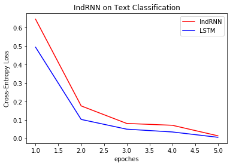
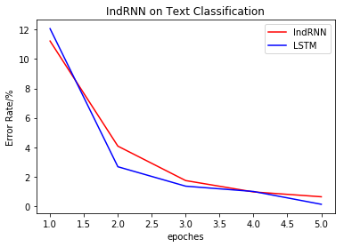

# IndRNN test on text classification

This is a [IndRNN](https://arxiv.org/abs/1803.04831) implementation on [cntk](https://github.com/Microsoft/CNTK). This repo applies it on text classification.

My rewrite of the cntk code is somehow ugly now. Apologize for that

### Prerequisites

- python 3.6
- cntk 2.4 for GPU
- numpy

### Dataset

The toy dataset used is ATIS, which is from cntk tutorial [202 Language Understanding with Recurrent Networks](https://cntk.ai/pythondocs/CNTK_202_Language_Understanding.html)

Download ATIS [training](https://github.com/Microsoft/CNTK/blob/release/2.5/Tutorials/SLUHandsOn/atis.train.ctf) and [test](https://github.com/Microsoft/CNTK/blob/release/2.5/Tutorials/SLUHandsOn/atis.test.ctf) dataset

### Model

$h_t = \sigma (Wx_t + u \odot h_{t-1} + b)$

### Result on toy dataset

Toy dataset train result

